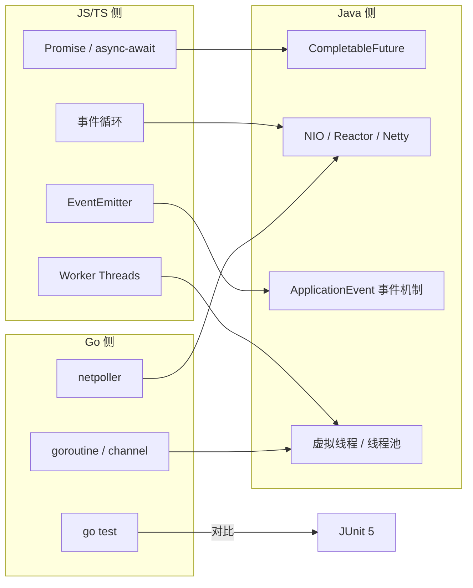
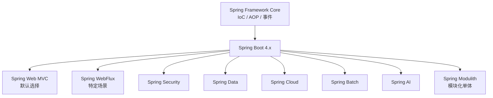
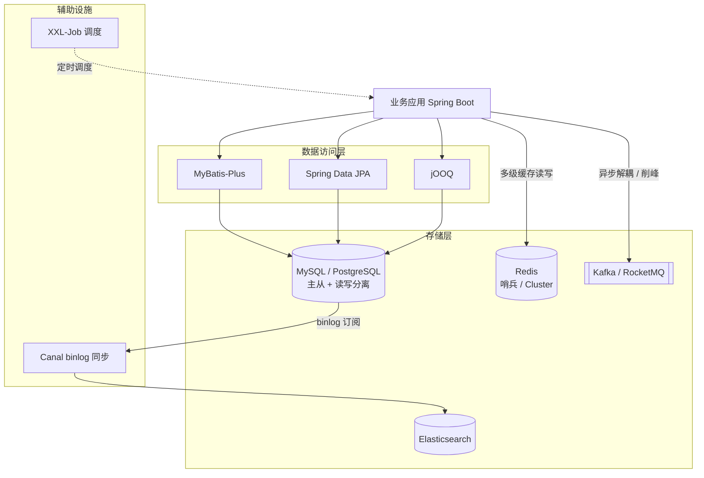
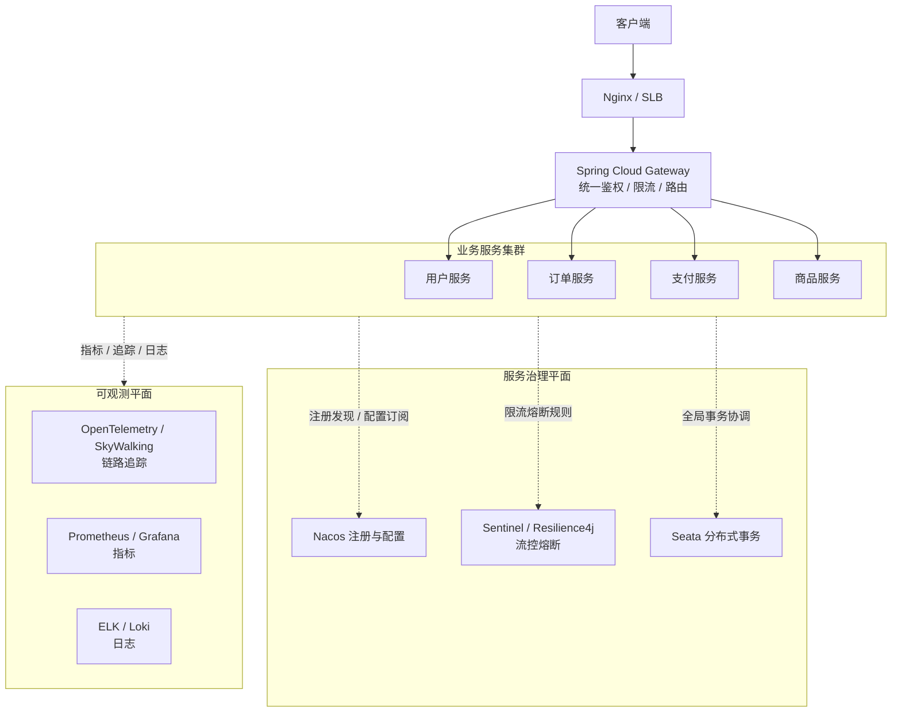
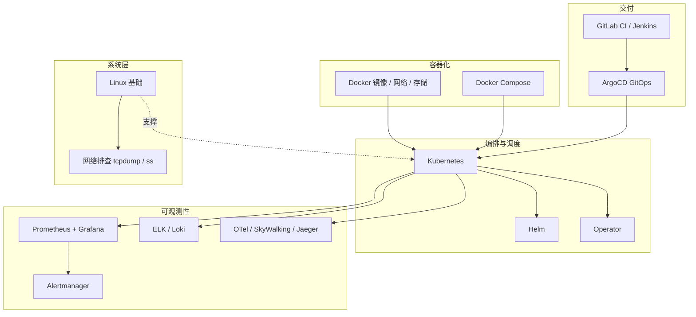
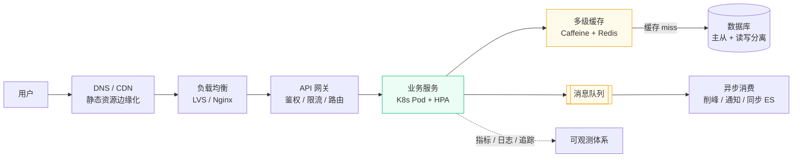
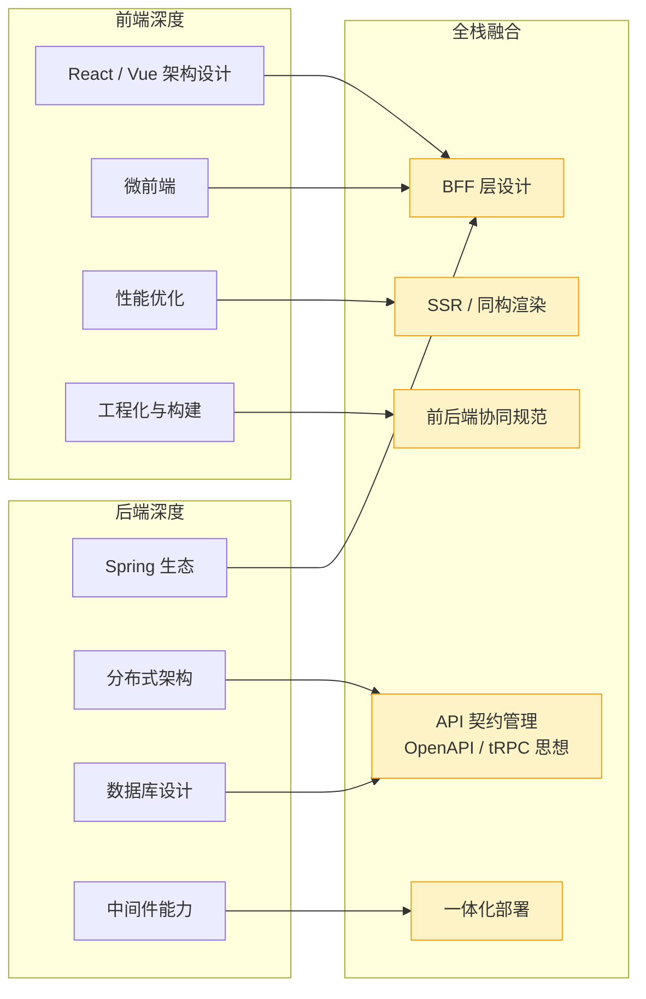
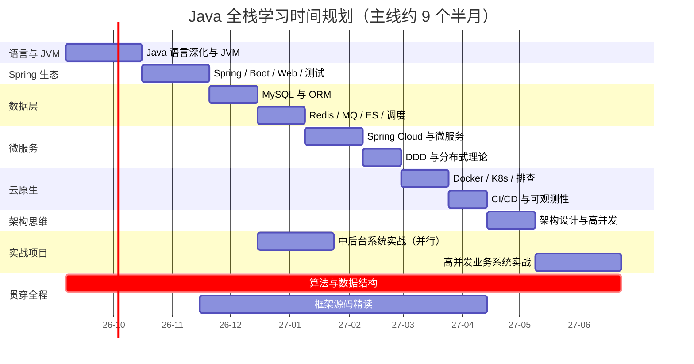

# Java 企业级全栈开发学习大纲

> ⚠️ 本文件为**拆解前的完整大纲快照**，仅供对照与回溯。**日常学习请以 docs/ 目录下的阶段拆分文件为准**（编号 00-阶段零 ... 07-阶段七 + 配套 08-11）。改动时请先改拆分文件，再回头同步本大纲，避免双份漂移。

> 面向具备 10 年前端经验（React / Vue / TypeScript / NestJS / NodeJS）、有 Go 与 Java 基础语法的开发者，系统构建 Java 企业级全栈能力。基线版本：Java 25 LTS + Spring Boot 4.x + Jakarta EE 11。

---

## 学习路径总览

整体学习分七个阶段，由语言基础 → 框架生态 → 分布式架构 → 云原生运维 → 架构思维 → 全栈实战逐步推进。每个阶段都以前一阶段为前提，部分阶段可并行展开。

```mermaid
flowchart TD
    subgraph P0[阶段 0：起点盘点与补课]
        A0[Java 基础语法 / OOP]
        A1[Go 并发与后端思维]
        A2[NestJS / NodeJS 服务端经验]
        A3[前端工程化与架构能力]
    end

    subgraph P1[阶段 1：Java 语言深化与 JVM]
        B1[Java 8 函数式基础]
        B2[Java 17 / 21 / 25 新特性]
        B3[JVM 内存结构与 GC]
        B4[JMM 与并发编程]
        B5[集合框架与源码]
    end

    subgraph P2[阶段 2：Spring 生态与 Web 核心]
        C1[Spring Framework 核心]
        C2[Spring Boot 4.x 实战]
        C3[Spring Web MVC / WebFlux]
        C4[Spring Security 认证授权]
        C5[测试工程 JUnit5 / Mockito]
    end

    subgraph P3[阶段 3：数据持久化与中间件]
        D1[MySQL / PostgreSQL 深度]
        D2[MyBatis / JPA / jOOQ]
        D3[Redis 缓存与分布式锁]
        D4[消息队列 Kafka / RocketMQ]
        D5[Elasticsearch 与定时任务]
    end

    subgraph P4[阶段 4：微服务与分布式]
        E1[Spring Cloud Alibaba]
        E2[Nacos / Sentinel / Seata]
        E3[分布式事务与一致性]
        E4[DDD 领域驱动设计]
        E5[RPC：Dubbo / gRPC]
    end

    subgraph P5[阶段 5：云原生与运维工程]
        F1[Docker / Kubernetes]
        F2[CI/CD 与平台工程]
        F3[可观测性 Prometheus / Grafana]
        F4[Linux 与系统排查]
    end

    subgraph P6[阶段 6：架构设计与服务端思维]
        G1[高并发 / 高可用 / 高性能]
        G2[常见架构模式]
        G3[容量规划与压测]
        G4[安全架构与合规]
    end

    subgraph P7[阶段 7：全栈融合与项目实战]
        H1[前端架构 + 后端架构一体化]
        H2[企业级中后台系统]
        H3[高并发业务系统]
    end

    P0 --> P1
    P1 --> P2
    P2 --> P3
    P3 --> P4
    P4 --> P5
    P4 --> P6
    P5 --> P6
    P6 --> P7
    P3 --> P7

    style P0 fill:#f0f4ff,stroke:#6366f1
    style P1 fill:#ecfdf5,stroke:#10b981
    style P2 fill:#ecfdf5,stroke:#10b981
    style P3 fill:#fffbeb,stroke:#f59e0b
    style P4 fill:#fffbeb,stroke:#f59e0b
    style P5 fill:#fef2f2,stroke:#ef4444
    style P6 fill:#faf5ff,stroke:#8b5cf6
    style P7 fill:#fdf2f8,stroke:#ec4899
```

> **学习节奏预期**：在职学习（每天 2–3 小时 + 周末加量），主线约 9–10 个月，达到"能独立负责企业级模块设计与开发的中高级后端"。架构师方向需要在此基础上再叠加 1–2 年真实项目沉淀。阶段 1–3 是硬基础，不可跳过；阶段 4–6 可根据工作需要调整优先级。
>
> 阶段 3 完成后即可启动项目 1（中后台系统），与阶段 4–5 的学习并行推进，边学边练。

---

## 阶段 0：起点盘点与补课清单

在正式开始前，先盘点你的既有能力对 Java 后端学习的直接迁移，并补齐工程环境类的缺口。这一阶段预计 1–2 周，目标是"环境就绪、路径清晰"。

### 能力迁移对照

| 你已有的 | 对 Java 学习的价值 | 迁移方式 |
|----------|-------------------|----------|
| NestJS（DI / 装饰器 / 模块化） | Spring 的 IoC / AOP / 注解体系几乎是同构概念 | 概念映射，语法重学 |
| TypeScript 类型系统 | 泛型、协变逆变、类型擦除的取舍理解很快 | 对比学习 |
| Go 并发（goroutine / channel） | 虚拟线程、内存可见性问题的直觉已有 | 对比 happens-before 语义 |
| NodeJS 事件循环 | NIO / Reactor / Netty 的事件驱动模型 | 对比单线程事件循环 vs 多路复用 |
| 前端工程化（npm / Vite / CI） | Maven / Gradle、依赖作用域、多模块工程 | 概念一致，工具重学 |

### 需要补的工程环境

- **JDK 发行版**：Temurin（Eclipse Adoptium）/ Corretto（Amazon），理解 Oracle JDK 与 OpenJDK 的关系、LTS 版本节奏（17 → 21 → 25，25 起 LTS 间隔缩短为 2 年）
- **构建工具**：Maven（国内主流）与 Gradle（Android / 部分新项目）二选一深入，重点掌握依赖传递与冲突排除（`mvn dependency:tree`）、多模块聚合工程、BOM 统一版本管理——对应前端的 npm / pnpm / workspace
- **IDE**：IntelliJ IDEA（社区版可用），调试器、重构、Spring 插件链
- **代码规约**：阿里巴巴 Java 开发手册（国内企业事实标准），配合 IDE 插件实时检查

---

## 阶段 1：Java 语言深化与 JVM 体系

从"会写 Java"到"理解 Java"。你有 Go 和 TypeScript 的基础，对比学习会非常快——重点是理解 JVM 的独特设计哲学。

### 核心知识

| 模块 | 关键内容 | 学习目标 |
|------|----------|----------|
| **Java 8 函数式与核心库** | Lambda 与函数式接口、Stream（惰性求值 / 短路操作）、Optional、java.time、方法引用 | 补齐函数式基础。你"了解 Java 基础语法"，函数式和 Stream 不能默认掌握，这是后续一切代码阅读的地基 |
| **Java 17 / 21 / 25 语言特性** | 密封类（17）、record（16）与 record 模式（21）、switch 模式匹配（21）、虚拟线程（21）、作用域值 Scoped Values（25 转正）、结构化并发（25 预览，JEP 505）、紧凑 main 与模块导入声明（25）、Stable Values（25 预览） | 用现代 Java 写业务代码；理解演进方向（Valhalla 值类在 JDK 28 起预览，了解路线图即可） |
| **泛型、反射、注解、动态代理** | 类型擦除与通配符 PECS、反射 API 与性能代价、注解的 Retention 策略、JDK 动态代理 vs CGLIB | 这是 Spring / MyBatis 一切"魔法"的底层机制，必须吃透 |
| **JVM 内存结构** | 堆 / 栈 / 方法区 / 元空间、运行时数据区划分、类加载机制与双亲委派、JIT 分层编译 | 能排查 OOM、分析内存泄漏、理解字节码层面发生了什么 |
| **JMM（Java 内存模型）** | happens-before 规则、volatile 的可见性与禁用重排序、final 的安全发布语义、synchronized 锁升级（偏向锁已废弃 → 轻量级 → 重量级）、ThreadLocal 原理与内存泄漏 | 注意：JMM（并发语义规范）与 JVM 内存结构（运行时数据区）是两个概念，文档与面试中都不能混用 |
| **垃圾回收** | G1（默认）/ ZGC（分代模式，21 引入）/ Shenandoah、三色标记与漏标、GC 日志分析、基础调优参数 | 能根据业务场景选 GC，看懂 GC 日志，判断是内存泄漏还是流量问题 |
| **并发编程** | AQS 原理、CAS 与 Atomic 类、线程池参数设计与拒绝策略、CompletableFuture、ThreadLocal、虚拟线程（Project Loom）：与平台线程的差异、pinning 场景 | 能写线程安全的代码；会用虚拟线程扛 IO 密集并发，并理解它不能替代 CPU 密集的并行计算 |
| **集合框架** | ArrayList / LinkedList / HashMap / ConcurrentHashMap 源码、扩容与树化阈值、fail-fast 机制、跳表（ConcurrentSkipListMap） | 能手绘 HashMap 结构图，讲清为什么并发修改会抛 ConcurrentModificationException |
| **IO 与 NIO** | BIO / NIO / AIO、多路复用（select / poll / epoll）、零拷贝、Netty（事件循环、Channel、ByteBuf） | 理解 NodeJS 事件循环与 Java NIO 的异同，为 WebFlux 和 RPC 框架打基础 |
| **网络与协议基础** | TCP 三次握手 / 四次挥手、TIME_WAIT、HTTP/1.1 keep-alive → HTTP/2 多路复用 → HTTP/3 QUIC、TLS 握手过程 | 后端开发的底层必修课，排查连接耗尽、慢请求都依赖这些 |

### 与你现有知识的映射

### 能力自检

- 虚拟线程适合 IO 密集还是 CPU 密集？为什么在 synchronized 块内执行阻塞操作可能导致 pin 住载体线程？
- `volatile int i; i++` 是线程安全的吗？happens-before 到底给了什么保证？
- HashMap 的扩容流程？为什么 JDK 8 要引入红黑树转换？
- ThreadLocal 为什么会内存泄漏，如何正确清理？
- JDK 动态代理和 CGLIB 的区别？为什么 Spring 默认对接口用 JDK 代理？

### 推荐资源

- 《Effective Java》第 3 版（Joshua Bloch，2018）——经典条目式准则，基于 Java 9，读时结合新特性自行更新心智
- 《深入理解 Java 虚拟机》第 3 版（周志明）——JVM 与并发部分按需精读
- [Java 语言官方变更文档](https://docs.oracle.com/en/java/javase/25/language/java-language-changes.html) 与 [JEP 索引](https://openjdk.org/jeps/0)
- [Project Loom](https://openjdk.org/projects/loom/) / [Project Leyden](https://openjdk.org/projects/leyden/)（AOT 启动优化）

---

## 阶段 2：Spring 生态与 Web 开发核心

Spring 是 Java 企业级开发的事实标准。你有 NestJS 经验——NestJS 的依赖注入、装饰器、模块化设计大量借鉴了 Spring，迁移成本比你想象的低。

### 知识图谱

### 核心知识

#### 2.1 Spring Framework 核心

- **IoC 容器**：Bean 生命周期（实例化 → 属性填充 → 初始化 → BeanPostProcessor 两个回调时机 → 销毁）、作用域（singleton / prototype / web 三件套）、`@Configuration` / `@Bean` / `@Import`、循环依赖与三级缓存
- **AOP**：动态代理选择策略、切面 / 通知 / 切点、`@AspectJ`、声明式事务原理与传播行为、AOP 失效场景（自调用）
- **事件机制**：ApplicationEvent / ApplicationListener、`@TransactionalEventListener`
- **资源与环境**：Resource 抽象、Environment / Profile、PropertySource 体系

#### 2.2 Spring Boot 4.x 实战

- **自动装配原理**：`@SpringBootApplication` 拆解、starter 机制、`@Conditional` 系列条件装配、`spring.factories` 与 AutoConfiguration.imports 的演进
- **配置体系**：application.yml、多环境（profile）、`@ConfigurationProperties` 松散绑定与校验、外部化配置优先级
- **内置容器**：Tomcat / Jetty / Undertow 切换、过滤器与拦截器的执行顺序
- **监控**：Actuator 健康检查、指标暴露、自定义 Endpoint
- **AOT 与原生镜像**：GraalVM Native Image、Project Leyden AOT 缓存（Java 25 GA 支持，启动提速约 40%+、因应用而异）、什么场景值得上原生镜像
- **日志体系**：SLF4J 门面 + Logback / Log4j2 实现、MDC 塞 TraceID 实现日志链路标记、日志规约（级别语义、敏感信息脱敏）

#### 2.3 Web 层

- **Spring Web MVC**：RESTful 设计、参数绑定与转换、`@RestControllerAdvice` 全局异常、Jakarta Bean Validation 校验、文件上传、CORS
- **API 设计规范**：统一响应体与错误码设计、接口版本化策略、幂等设计（防重 token / 唯一索引 / 状态机）、分页规范
- **接口文档**：SpringDoc / OpenAPI 3.0（对标 NestJS 生态的 Swagger）
- **Spring WebFlux**：Reactor（Mono / Flux）、背压、RouterFunction
  - **选型判断（重要）**：虚拟线程 GA 之后，绝大多数业务系统用 WebMVC + 虚拟线程即可获得高并发能力，学习优先级应放在 WebMVC 之后；WebFlux 主要用于 API 网关、SSE 流式推送、需要精细背压控制的管道型场景。不要在响应式编程上过早投入
- **测试工程（贯穿全程）**：
  - JUnit 5：生命周期、参数化测试、断言库（AssertJ）
  - Mockito：mock / stub / verify、静态方法与构造器 mock 的边界
  - Spring Test 切片：`@WebMvcTest` / `@DataJpaTest` / `@SpringBootTest` 的取舍
  - Testcontainers：用真实容器跑 MySQL / Redis / Kafka 做集成测试，替代内存数据库的"假绿色"
  - 覆盖率与质量门禁：JaCoCo、SonarQube
  - 测试金字塔：单元 → 集成 → E2E 的比例分配

#### 2.4 认证与授权

- **Spring Security**：过滤器链架构、认证管理器、UserDetailsService、密码编码器（BCrypt）
- **JWT**：无状态认证、Token 刷新与续期、黑名单 / 登出方案
- **OAuth 2.1 / OIDC**：授权码模式 + PKCE、授权服务器与资源服务器的角色、第三方登录（Spring Authorization Server）
- **RBAC / ABAC**：权限模型设计、方法级安全 `@PreAuthorize`
- **SSO 与微服务鉴权**：Gateway 统一鉴权、Token 在服务间的传递与校验

### 与 NestJS 的对比学习

| NestJS 概念 | Spring 对应 | 关键差异 |
|-------------|-------------|----------|
| `@Module` | `@Configuration` + `@ComponentScan` | Spring 自动扫描更隐式，NestJS 更显式 |
| `@Injectable` | `@Service` / `@Component` | 概念一致，Spring 派生注解更多（按分层语义） |
| `@Controller` | `@RestController` | 几乎一致 |
| Guard | Filter / Interceptor | Spring 过滤器链更灵活、粒度更细 |
| Pipe | `@Valid` + Bean Validation | 标准化注解校验，生态更成熟 |
| Interceptor | HandlerInterceptor / AOP | AOP 能力远超 NestJS Interceptor |
| TypeORM / Prisma | Spring Data JPA / MyBatis-Plus | JPA 是标准，MyBatis 对 SQL 掌控更直接 |
| Jest + Supertest | JUnit 5 + Mockito + Testcontainers | Java 测试工具链更重但更工程化 |

### 能力自检

- `@Transactional` 失效的场景能列举几个？（自调用、非 public 方法、异常被捕获、传播属性错配、多线程边界）
- Bean 生命周期中 BeanPostProcessor 的两个回调分别在什么时机？三级缓存怎么解决循环依赖？
- WebMVC + 虚拟线程 和 WebFlux 怎么选？各自适合什么场景？
- 自动装配是怎么发生的？写一个自定义 starter 需要哪几步？
- Testcontainers 相比 H2 内存库做集成测试的本质优势是什么？

### 推荐资源

- [Spring 官方文档](https://docs.spring.io/spring-framework/reference/)（质量极高的第一手资料）
- 《Spring 实战》第 6 版（Craig Walls，覆盖 Spring 6 / Boot 3，概念在 4.x 依然适用）
- Spring 官方 GitHub 的 [spring-boot 示例库](https://github.com/spring-projects/spring-boot/tree/main/spring-boot-project/spring-boot-starters)
- Spring Academy（官方免费交互课程）

---

## 阶段 3：数据持久化与中间件

数据层是后端的基石。前端转后端最容易踩坑的地方就是"数据库思维"——索引、事务、锁、慢查询，这些在前端几乎不接触。

### 技术栈全景

### 核心知识

#### 3.1 关系型数据库深度

- **MySQL 内核**：InnoDB、聚簇索引与二级索引、B+ 树（为什么不是 B 树 / 跳表 / 哈希）、回表与覆盖索引、MVCC 与 ReadView、四大隔离级别
- **SQL 优化**：慢查询日志、EXPLAIN 执行计划（type / key / rows / Extra）、最左前缀与索引失效场景
- **事务与锁**：当前读 / 快照读、行锁 / 间隙锁 / Next-Key Lock、死锁排查（`SHOW ENGINE INNODB STATUS`）
- **高可用与扩展**：主从复制（异步 / 半同步）、GTID、读写分离的延迟问题、分库分表（ShardingSphere-JDBC、分片键设计、跨分片查询与分布式主键）
- **PostgreSQL 特色**：JSONB、CTE、窗口函数、MVCC 实现差异（多版本无回滚段）

#### 3.2 ORM / 数据访问

- **MyBatis / MyBatis-Plus**：XML 映射、动态 SQL、分页插件、逻辑删除、自动填充——国内企业主流，必学
- **Spring Data JPA**：Repository 抽象、方法名派生查询、`@Query`、Specification、N+1 问题与 `@EntityGraph` 解法
- **jOOQ**：类型安全的 SQL DSL、代码生成（适合喜欢 TypeScript 类型安全的你）
- **多数据源**：动态数据源路由、读写分离落地

#### 3.3 缓存体系

- **Redis 数据结构与应用**：String / Hash / List / Set / ZSet / Bitmap / HyperLogLog / Stream，各自的典型场景
- **缓存模式与一致性**：Cache-Aside / Write-Through / Write-Behind、延迟双删、订阅 binlog 的最终一致方案
- **三大经典问题**：穿透（布隆过滤器）、击穿（互斥重建 / 逻辑过期）、雪崩（随机 TTL / 多级缓存）
- **分布式锁**：Redisson（看门狗续期、可重入、RedLock——注意 RedLock 在分布式系统学界存在争议，生产使用需评估，单实例 Redisson + 主从通常已够用）
- **持久化与高可用**：RDB / AOF / 混合持久化、主从 → 哨兵 → Cluster 的演进、Cluster 的 16384 槽与MOVED 重定向、大 key 与热 key 治理
- **多级缓存**：Caffeine 本地缓存 + Redis + 一致性权衡

#### 3.4 消息队列

- **Kafka**：Topic / 分区 / 副本 / ISR、消费者组与重平衡、顺序性保证（分区键）、零拷贝与顺序写的存储设计、Exactly-Once 语义、消费幂等
- **RocketMQ**：事务消息（半消息 + 回查）、延时消息、死信队列——国内金融电商常用
- **选型与场景**：异步解耦、削峰填谷、事件驱动；消息不丢的三段论（生产 confirm → broker 持久化 → 消费手动 ack）

#### 3.5 搜索与调度

- **Elasticsearch**：倒排索引原理、分词（IK）、DSL 查询、聚合分析、与 MySQL 的数据同步（Canal / MQ）、深分页问题
- **定时任务**：Spring Scheduler 的局限（单点、无重试）、XXL-Job（可视化调度、分片广播、失败重试）、时间轮简介

### 能力自检

- 为什么 MySQL 用 B+ 树而不是 B 树、跳表或哈希索引？
- 缓存与数据库双写一致性有哪些方案？各自的一致性窗口多大？
- Redis Cluster 怎么定位一个 key 属于哪个节点？客户端为什么会收到 MOVED？
- Kafka 从生产到消费全链路，怎么保证消息不丢、不重？
- 订单表 5000 万行了，你的演进路线是什么？

### 推荐资源

- 《高性能 MySQL》第 4 版 + 《MySQL 技术内幕：InnoDB 存储引擎》第 2 版
- 《Redis 设计与实现》（黄健宏）
- [Kafka 官方文档](https://kafka.apache.org/documentation/) 与《Kafka 权威指南》第 2 版
- [Elasticsearch 官方教程](https://www.elastic.co/guide/index.html)

---

## 阶段 4：微服务架构与分布式系统

从单体到微服务，不仅是技术栈的变化，更是思维方式的转变——服务拆分、数据一致性、故障容错、链路追踪，每一个都是大坑。先记住一个前提：**微服务不是默认选项**。2026 年的主流认知是"能单体的先单体"，模块化单体（Spring Modulith）与轻量拆分在中小团队是更务实的选择，微服务适用于团队规模与业务复杂度真正需要时。

### 微服务架构全景

### 核心知识

#### 4.1 Spring Cloud Alibaba（国内企业主流）

- **Nacos**：注册发现与配置中心一体、命名空间 / 分组、配置动态刷新（长轮询机制）、AP / CP 模式切换
- **Sentinel**：滑动窗口流控、熔断降级、热点参数限流、系统自适应保护——对比 Spring Cloud 官方推荐的 Resilience4j（更轻、函数式、无控制台依赖）
- **Seata**：AT / TCC / SAGA / XA 模式原理与选型，AT 模式的 undo_log 全局锁回滚机制及适用边界
- **Spring Cloud Gateway**：路由断言与过滤器工厂、全局鉴权、灰度发布（按 header / 权重路由）

#### 4.2 分布式核心理论

- **CAP**：为什么 P 不可放弃、分区发生时 C 与 A 的取舍；ZooKeeper 是 CP、Eureka 是 AP、Nacos 可切换
- **BASE**：基本可用、软状态、最终一致性——柔性事务的理论基础
- **一致性算法**：Raft（选举、日志复制）理解原理即可，能讲清 ZooKeeper / Nacos / etcd 各自用什么
- **分布式 ID**：雪花算法（时钟回拨问题）、号段模式（Leaf）、UUID 为什么不适合做主键
- **分布式锁选型**：Redis（性能）vs Zookeeper（可靠性）vs 数据库（简单低并发）

#### 4.3 DDD 领域驱动设计

- **核心概念**：领域 / 子域 / 限界上下文 / 聚合根 / 实体 / 值对象 / 领域事件 / 防腐层
- **分层架构**：接口层 / 应用层 / 领域层 / 基础设施层，依赖倒置怎么落地
- **事件风暴**：从业务事件梳理到服务边界的完整流程
- **CQRS 与 Event Sourcing**：命令查询分离、事件溯源的收益与成本
- **与微服务的关系**：限界上下文 ≈ 微服务边界；模块化单体（Spring Modulith）是 DDD 的第一步落地形态

#### 4.4 服务间通信与 RPC

- **同步调用**：OpenFeign（声明式 HTTP，简单）、连接池与超时重试配置、重试必须配合幂等
- **Dubbo 3**：Triple 协议（兼容 gRPC）、应用级服务发现、与 OpenFeign 的选型对比（性能 vs 生态简单性）——国内老牌企业大量存量
- **gRPC**：HTTP/2 + Protobuf、四种流模式、跨语言场景
- **异步通信**：事件驱动架构、领域事件、Outbox 模式保证事件可靠投递
- **服务网格**：Istio / Envoy 的 Sidecar 模式、mTLS、流量镜像——了解原理与适用边界即可，中小团队优先看 Spring Cloud Gateway + K8s 原生能力

### 能力自检

- Seata AT 模式怎么用 undo_log 实现回滚？什么场景 AT 不适用要换 TCC？
- CAP 的 P 为什么不可选？分区发生时你系统选 C 还是 A，依据是什么？
- Feign 配置了超时重试，接口设计上必须配合什么？
- 固定窗口、滑动窗口、令牌桶、漏桶四种限流算法各自的优劣？
- 一次跨 3 个服务的下单流程，你选 Seata、Saga 还是本地消息表，为什么？

### 推荐资源

- 《微服务架构设计模式》（Chris Richardson）——微服务领域的百科全书，事件驱动 / Saga / CQRS 讲得最透
- 《实现领域驱动设计》（Vaughn Vernon）
- [Spring Cloud Alibaba 官方文档](https://sca.aliyun.com/) / [Seata 官方文档](https://seata.apache.org/zh-cn/)
- [Spring Modulith 官方文档](https://docs.spring.io/spring-modulith/reference/)（模块化单体）

---

## 阶段 5：云原生与运维工程

"不会运维的后端不是好全栈"。企业级开发中，你写的代码最终要跑在 Kubernetes 上，出了问题你要能定位。

### 知识体系

### 核心知识

#### 5.1 容器化基础

- **Docker**：Dockerfile 最佳实践（多阶段构建、层缓存）、镜像瘦身（Alpine / Distroless / jlink 定制 JRE）、镜像仓库与漏洞扫描
- **Docker Compose**：本地一键拉起 MySQL + Redis + Kafka 的开发环境

#### 5.2 Kubernetes

- **核心对象**：Pod / Deployment / StatefulSet / DaemonSet / Job / CronJob、Service / Ingress / ConfigMap / Secret / PV / PVC
- **网络模型**：ClusterIP / NodePort / LoadBalancer、Ingress Controller、Service 与 Ingress 与网关三层的职责边界
- **发布策略**：滚动更新（maxSurge / maxUnavailable）、回滚、蓝绿、金丝雀（Argo Rollouts）
- **Spring Boot on K8s**：liveness / readiness / startup 探针的语义差异、preStop + 优雅停机避免丢流量、资源 requests / limits、HPA 基于 CPU / QPS 自动扩缩
- **Helm**：Chart 模板、values 分环境管理
- **故障排查路径**：Pod Pending（调度失败：资源不足 / 亲和性 / PV 未绑定）→ CrashLoopBackOff（看 logs 与 events）→ Service 不通（endpoints 为空？label selector？）

#### 5.3 CI/CD 与平台工程

- **流水线设计**：代码检查 → 单测 → 构建镜像 → 推送仓库 → 部署测试环境 → 集成测试 → 生产发布（审批门禁）
- **GitLab CI / Jenkins**：Pipeline as Code、构建缓存、多环境 promotion
- **GitOps**：ArgoCD 声明式部署、应用与配置的版本化、漂移检测与回滚
- **平台工程**：内部开发者平台（IDP）理念、金丝雀与特性开关（Feature Flag）解耦发布与上线

#### 5.4 可观测性体系

- **Metrics**：Prometheus + Grafana、四大黄金信号（延迟 / 流量 / 错误 / 饱和度）、Micrometer 埋点、RED / USE 方法
- **Logging**：ELK（Elasticsearch + Filebeat + Kibana）或轻量 Loki、结构化 JSON 日志、MDC TraceID 关联
- **Tracing**：OpenTelemetry 统一规范（未来事实标准）、SkyWalking（国内主流，Java Agent 无侵入）/ Jaeger、跨服务 TraceID 透传
- **告警**：Alertmanager 分级、告警疲劳治理、On-Call 闭环

#### 5.5 Linux 与系统排查

- **基础命令**：进程与资源（top / vmstat / iostat / pidstat）、网络（ss / netstat / lsof / tcpdump 抓包）、磁盘（df / du / iostat）
- **Java 进程诊断**：jstack 抓线程栈（定位死锁 / 高 CPU：线程号 + 十六进制 nid 对照）、jmap 堆快照、jstat GC 统计、Arthas 在线诊断（watch / trace / dashboard）
- **火焰图**：async-profiler 生成 CPU / 内存火焰图，找热点方法

### 能力自检

- Pod 一直 Pending，你的排查步骤是什么？
- liveness 探针配到了一个依赖下游的接口上，会发生什么事故？
- Service、Ingress、Spring Cloud Gateway 三层各自解决什么问题？
- 滚动更新时怎么保证在途请求不丢？
- 线上 Java 进程 CPU 100%，用 jstack / Arthas 怎么定位到代码行？

### 推荐资源

- 《Kubernetes in Action》第 2 版
- [Kubernetes 官方教程](https://kubernetes.io/zh-cn/docs/tutorials/)
- [OpenTelemetry 官方文档](https://opentelemetry.io/docs/)
- Google SRE 书系《SRE：Google 运维解密》

---

## 阶段 6：架构设计与服务端思维

技术栈可以速成，但架构思维需要沉淀。这是区分"会用 Spring Boot 的前端"和"真正的后端架构师"的分水岭。

### 架构设计能力矩阵

| 维度 | 初级 | 中级 | 高级 |
|------|------|------|------|
| **高并发** | 知道 Redis 缓存 | 会做读写分离、分库分表 | 能设计全链路压测、容量规划、多级缓存体系 |
| **高可用** | 知道主从复制 | 会做集群、限流降级 | 能设计异地多活、故障演练、混沌工程 |
| **高性能** | 会写 SQL | 会做 SQL 优化、JVM 调优 | 能做全链路性能分析、瓶颈定位、架构级优化 |
| **可扩展** | 知道微服务 | 会做服务拆分 | 能设计事件驱动架构、领域建模、合理选单体或微服务 |
| **安全** | 会用 Spring Security | 懂 OWASP Top 10、XSS / CSRF | 能设计零信任架构、数据加密、合规审计 |

### 一次典型请求的完整链路

服务端思维的核心是把请求放进整个链路里看，而不是只盯着自己写的 Controller。

每一层都可能成为瓶颈，也都有对应的治理手段：CDN 层扛静态流量、网关层做第一道限流、缓存层挡住读压力、MQ 把写流量从同步变异步、可观测体系让你在用户报障之前发现问题。

### 核心知识

#### 6.1 高性能架构

- **优化方法论**：自上而下（业务裁剪 → 架构调整 → 代码优化 → JVM 调优 → OS / 硬件），先测量再优化
- **常见瓶颈**：慢 SQL、锁竞争、GC 停顿、连接池打满、缓存命中率劣化、序列化开销
- **分析工具**：Arthas / async-profiler（火焰图）/ JProfiler、p99 分位数思维

#### 6.2 高可用架构

- **度量**：SLA / SLO / SLI，几个 9 的真实成本（99.99% 意味着年停机 52 分钟）
- **冗余与故障转移**：主从切换、脑裂防护（仲裁 / quorum）
- **限流降级熔断**：四种限流算法对比、熔断的三态转换、降级预案（兜底数据 / 有损服务）
- **异地多活**：单元化架构、数据同步、流量调度
- **混沌工程**：故障注入、稳态假设验证

#### 6.3 架构模式

- **分层与演进**：三层架构 → DDD 四层 → 六边形架构 / 整洁架构
- **事件驱动**：Event Sourcing / CQRS / Outbox / Saga（编排式 vs 协同式）
- **经典模式**：Strangler Fig（绞杀者渐进迁移）、Sidecar、Ambassador、Bulkhead（舱壁隔离）
- **反模式识别**：分布式单体（拆了微服务但没有自治）、过度设计

#### 6.4 安全架构

- **OWASP Top 10**：注入、失效的访问控制、加密失败、SSRF、反序列化（Java 重灾区：Fastjson 历史漏洞）
- **认证授权**：OAuth 2.1 / OIDC / JWT 的最佳实践与误区（算法混淆、Token 撤销）
- **数据安全**：传输 TLS、存储加密、敏感字段脱敏（手机号 / 身份证）、日志脱敏
- **零信任**：最小权限、服务间 mTLS
- **合规**：等保 2.0 / 数据安全法 / 个人信息保护法（国内业务必须了解）

#### 6.5 容量规划与压测

- **容量评估**：QPS / TPS / RT / 并发数的关系（Little's Law）、峰值系数估算
- **压测**：JMeter / Gatling / k6、全链路压测（流量染色 + 影子表隔离）、单接口压测与场景压测的区别
- **产出**：容量水位报告、扩容预案、降级预案

#### 6.6 多租户设计（SaaS 数据隔离）

- **三种模型**：共享表 + tenant_id（逻辑隔离）/ 独立 Schema（库级隔离）/ 独立库（最强隔离），成本随隔离度递增
- **选型决策树**：租户数 / 数据量 / 合规约束 → 隔离方案（先共享表起步，别一上来每租户一库）
- **租户上下文**：tenant_id 从认证身份透传（禁请求体），ThreadLocal 传递 + finally clear
- **强制隔离**：TenantLine 拦截器自动拼 WHERE、唯一索引带租户、缓存 key 带租户
- **坑**：连接数爆炸、索引带租户前缀、噪邻、双租户测试矩阵

### 能力自检

- 设计一个 10w QPS 的秒杀系统，从 CDN 到数据库每一层怎么削峰？
- 数据库单表 5000w 行、日增 100w，给出 6 个月的演进方案
- 全链路压测怎么保证不污染线上数据？
- 你的服务 RT 突然从 50ms 涨到 2s，列出前 5 个排查动作和顺序

### 推荐资源

- 《数据密集型应用系统设计》（DDIA）——后端架构第一必读书，分布式存储 / 一致性 / 流处理全覆盖
- 《Site Reliability Engineering》+《The Practice of System and Network Administration》
- Martin Fowler 架构文集（网站免费）

---

## 阶段 7：全栈融合与项目实战

把前端能力和后端能力真正打通，形成"全栈架构"思维。你最大的优势是前端底子厚——不要丢，要把它变成差异化竞争力。

### 全栈能力模型

说明：tRPC 是 TypeScript 生态的端到端类型安全方案，Java 生态没有直接等价物，可借鉴其"契约先行"思想，落地用 OpenAPI 生成前端类型 + 契约测试保证前后端一致。

### 实战项目建议

#### 项目 1：企业级中后台管理系统（阶段 3 后启动）

- **前端**：React + TypeScript + Ant Design Pro / Vben Admin
- **后端**：Spring Boot 4 + MyBatis-Plus + MySQL + Redis，单元测试 + Testcontainers 集成测试，GitHub Actions 流水线
- **核心功能**：RBAC 权限、部门 / 字典管理、操作日志审计、代码生成器
- **重点**：前后端分离架构、API 契约管理、测试覆盖、把 CI/CD 全链路跑通

#### 项目 2：电商订单系统（高并发方向，阶段 6 后启动）

- **技术栈（三档递进）**：
  - 核心链路（必做）：Spring Boot + MyBatis-Plus + Redis 预扣库存 + 订单状态机 + 限流降级 + k6 压测
  - 扩展链路（选做）：RocketMQ 异步化 + 延时消息 + 分段库存
  - 延后扩展（可选）：ShardingSphere 分库分表、SkyWalking 链路追踪、K8s 部署（学完阶段 5 回来做架构升级练习）
- **核心功能**：下单、支付回调、库存扣减、订单状态机流转（ES 搜索、购物车标扩展/选做）
- **重点**：秒杀场景（缓存预热 + 令牌桶 + 异步下单 + 库存分段）、缓存一致性、消息削峰、压测报告

#### 项目 3：AI 应用平台（前沿方向，可选）

- **技术栈**：Spring AI（Spring 官方，与 Boot 4 深度集成）或 LangChain4j（二选一，前者生态集成好、后者灵活性高）+ Milvus / PGVector + React
- **核心功能**：RAG 知识库（文档解析 → 向量化 → 检索增强）、流式对话（SSE）、Prompt 版本管理
- **重点**：AI 工程化（重试 / 降级 / 成本控制）、向量检索调优、与后端传统架构（缓存 / MQ / 鉴权）的组合

---

## 学习时间规划（参考）

以在职学习节奏估算（每天 2–3 小时 + 周末加量），主线约 9–10 个月。项目实战与中后期学习并行安排。

> **说明**：
> - 主线任务 a1 → a9 → a11 串行推进，约 290 天；中后台实战（a10）在数据层完成后即启动，与微服务、云原生阶段并行
> - 算法在 LeetCode 持续刷（每天 1–2 题），Java 后端面试的中等难度题为主
> - 源码精读放在 Spring 学完之后，顺序建议：Spring IoC → MyBatis → Spring Boot 自动装配 → 线程池 / AQS（JDK）

---

## 学习方法建议

1. **对比学习法**：每学一个新概念，主动和你熟悉的 NestJS / NodeJS / Go 对比，找异同，理解设计取舍
2. **源码阅读法**：不必全读，按"IoC → 自动装配 → 事务"的顺序精读 Spring 核心链路，用 IDEA 的调试器单步跟一遍比看十篇博客有效
3. **项目驱动法**：阶段 3 完成后即启动中后台项目，让每个阶段的新知识都有落点
4. **输出倒逼输入**：写博客、画思维导图，能给别人讲清楚才算真懂
5. **面试检验法**：LeetCode 刷算法，牛客面经做查漏补缺的自测题库——每完成一个阶段，用文中的"能力自检"问题检验自己

---

## 企业招聘能力对标

| 职级 | 核心能力要求 | 对应学习阶段 |
|------|-------------|-------------|
| **Java 初级开发** | Spring Boot 增删改查、MySQL 基础、会用 Redis | 阶段 0–3 |
| **Java 中级开发** | 微服务开发、分布式问题排查、SQL 优化、JVM 基础调优、会写测试 | 阶段 0–4 + 阶段 6 部分 |
| **Java 高级开发** | 架构设计、高并发高可用、中间件原理、技术选型、K8s 与可观测体系 | 阶段 0–6 |
| **全栈架构师** | 前后端一体化架构、系统设计、团队技术领导力 | 全部阶段 + 多年项目沉淀 |

> 以你的前端背景 + 学习能力，目标可以直接定在高级开发 / 全栈架构师方向，用前端架构能力打差异化：BFF 设计、API 契约治理、SSR 与性能优化这些"前后端都要深"的领域，纯后端工程师反而薄弱。
